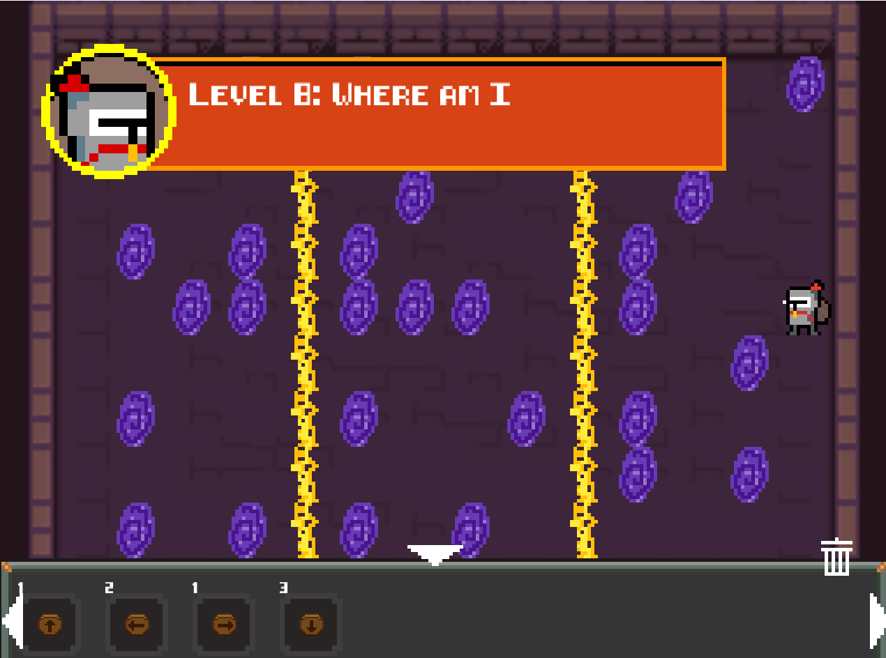

# ShadowLife

## Introduction

Welcome to Shengyu's Shadow Life Extension Pack.

This is a game modified from Shadow Life.
From now on, there will be no trees and animals. Instead, we will go to the Dungeon to explore.

What we have?
  - The brand new policy
  - Actors 
  - Levels 
  - Map editor 

The above features will be waiting for you.

## UI
New look for start page

New look for level page

## Policy

The new game rules require you to lead the knight to the chest, during which there will be monsters to block, use signs to plan your route.

Don't worry, sometimes help guide will give you some hints.

## Monster Book
### Skeleton

The lowest level creature, but still deadly to you.
  - The red-eyed Skeleton moves left and right. 
  - The blue-eyed Skeleton moves up and down.

### Spider

The most common creature in the dungeon will move diagonally and hit you by surprise.

### Magic tower

Ancient and lost magic items. A barrier will be constructed between the two magic towers to destroy all creatures that approach.

### Portal

No one has cracked the principle of this wonderful magic item so far, the only thing we know is that it will teleport humans.

### trap

Spiked traps are very dangerous. It will destroy the enemy above.

### Skull

A variant of Skeleton possesses magical power, and spit out a fireball during even-numbered steps.

### Witch

Long-lived and aggressive races will shoot two magic balls at odd steps.

## Level
We provide some challenges for you to overcome

## Map Editor
Feel tired about the challenges?
We provide map editor.
**Create your own map**

By clicking the make button on the start page, you can enter the map editor.
You can use any actor to create your own level.

To remove the actor, use the trash can button and click the unwanted actor.
don't forget to close it.

See more actor by clicking the white triangle.

Click run to test your level.

Only the passable level will be generated.

The signs used in the level will become the sign used in the game, so try to put more signs to confuse the player. (Just like me)

## Game Walkthrough
*This is a walkthrough, please click the piture to see*

1.
2.
3.
4.
5.
6.
7.
8.
9.
10.
11.
12.
13.
14.
15.

## Exisiting Bug

1. A lag happened when frequently clicked the **restart button** and **start button**.
2. When the game runs for a long time, it may causes **memory leak**

Fortunately, bugs on the above are located.